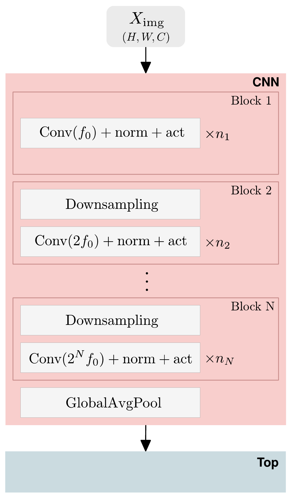
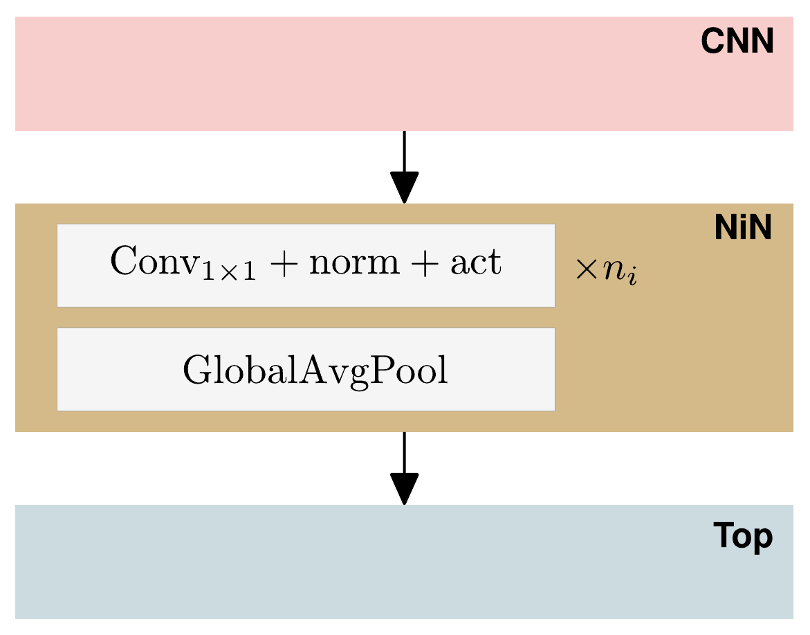
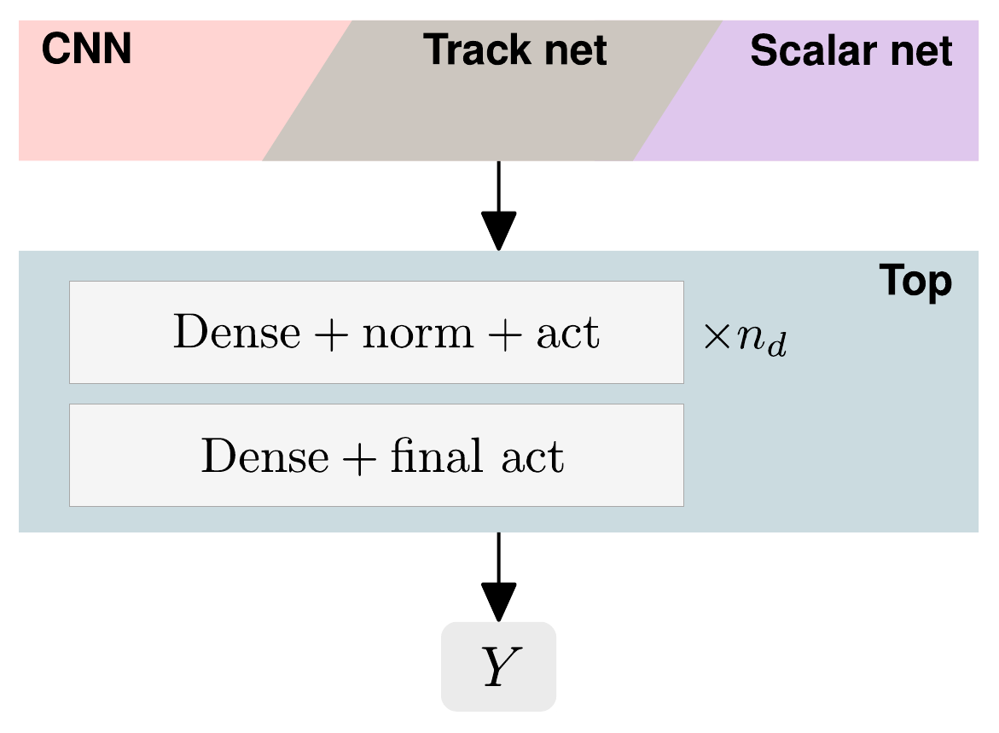
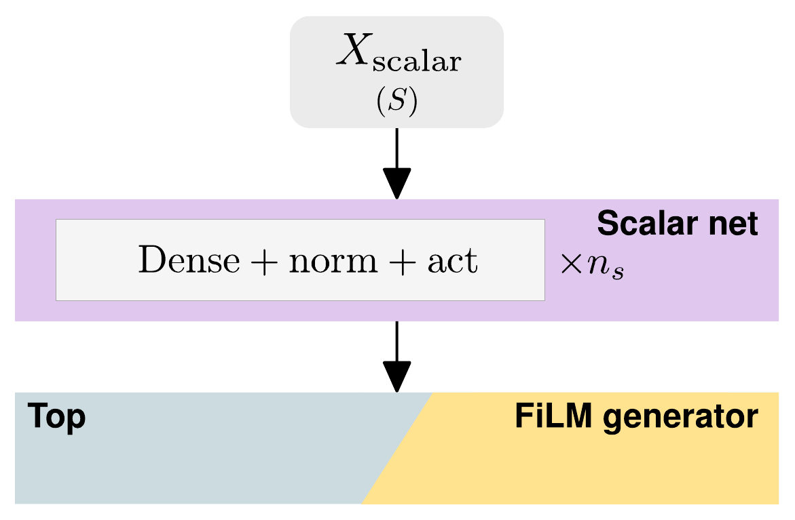
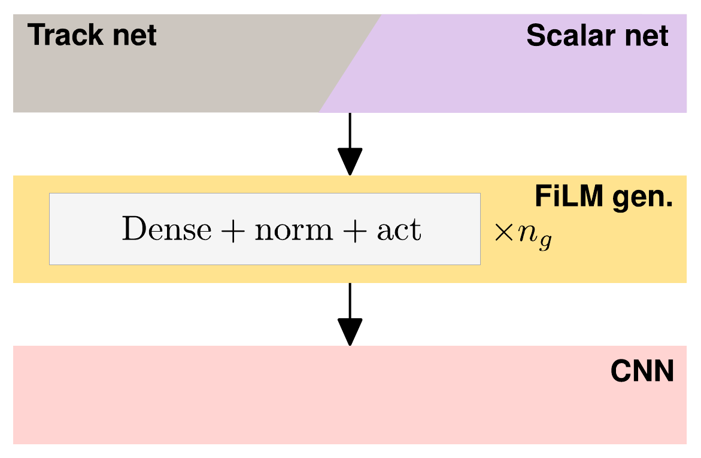
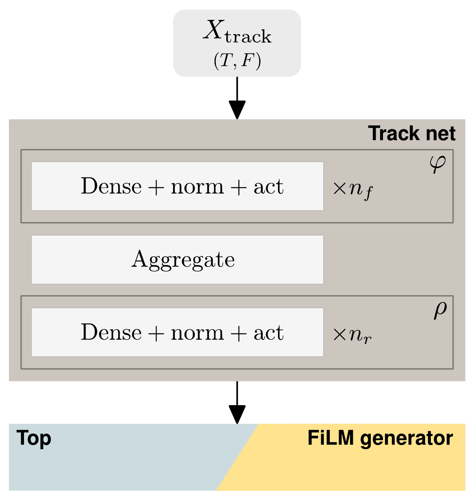
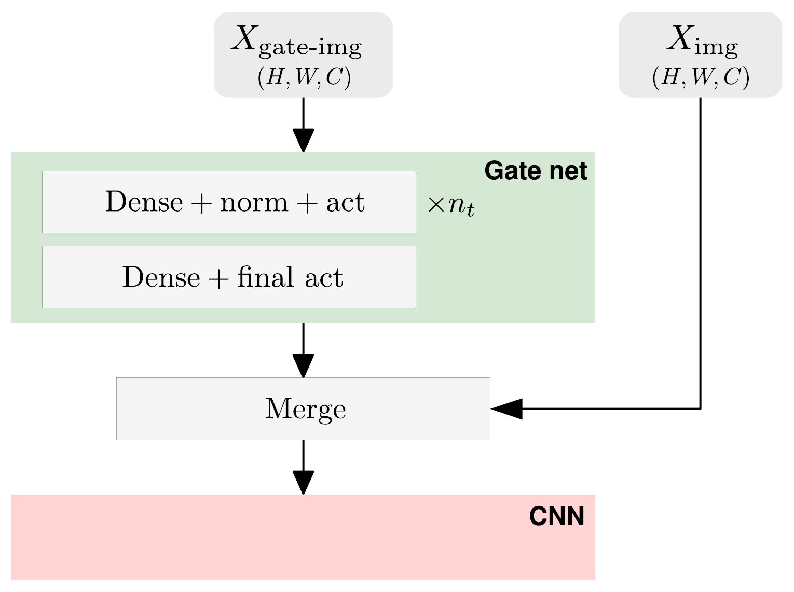
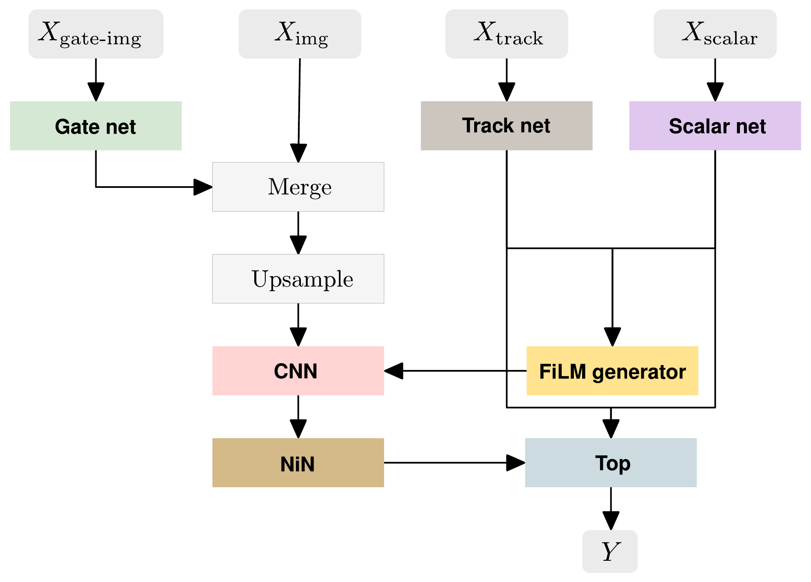

# DeepCalo
### Python 3 package for doing deep supervised learning on ATLAS data, using Keras
Author: Frederik Faye, The Niels Bohr Institute, 2019

## What is DeepCalo?
This package allows you to build, train and tune convolutional neural network (CNN) models using Keras with any backend.

You can also integrate models for processing non-image data, such as scalars and sequences.
The models that can be built have been designed specifically with the ATLAS detector in mind, but you can also just use the framework and all its nice features for any Keras-based project.

## Why should you use it?
* All hyperparameters are set through a single Python dictionary, making it very easy to experiment with different models.
* Extensive logging is automatically created for each run of a model, including hyperparameters, plots of model architectures, and weights of the model during training, making it easy to keep track of what you have tried, and what came of it.
* A lot of advanced features are supported (such as cyclic learning rate schedules, grouped convolutions, DropBlock regularization, squeeze and excite modules, non-standard optimizers such as Yogi and Padam, and much more), and it is easy to add new ones.

### Table of Content
- [Installation](#installation)
- [Dependencies](#dependencies)
- [Usage](#usage)
    - [Quick start for using generic data](#quickstart)
    - [Quick start for using ATLAS data](#atlasdata)
- [Model architectures](#archs)
    - [CNN](#arch_cnn)
    - [Network in network](#arch_network_in_network)
    - [Top](#arch_top)
    - [Scalar net](#arch_scalar_net)
    - [FiLM generator](#arch_film_gen)
    - [Track net](#arch_track_net)
    - [Gate net](#arch_gate_net)
    - [Combined](#arch_combined)
- [Documentation](#docs)
    - [`data`](#doc_data)
    - [`params`](#doc_params)
      - [Keys concerning submodels](#doc_submodels)
    - [`dirs`](#doc_dirs)

<a name="installation"></a>
## Installation
```bash
pip install deepcalo
```

<a name="dependencies"></a>
## Dependencies
```python
numpy, pandas, matplotlib, h5py, joblib, keras, tensorflow, keras-drop-block
```

If you want to be able to plot the graph of your model, please install `pydot` and `graphviz` (if possible, use `conda install python-graphviz` for `graphviz`).

<a name="usage"></a>
## Usage

<a name="quickstart"></a>
### Quick start for using generic data
The main functionality lies in the so-called model container, which can be imported as
```python
from deepcalo import ModelContainer
```
See the [documentation](#docs) below for all the details. However, often an example is a better way of learning. Some examples are found in the `demos` folder.

Download and run the MNIST tutorial:
```bash
python mnist_tutorial.py --exp_dir ./my_mnist_experiment/ -v 1
```
This will train a tiny CNN for a single epoch to discriminate between the digits of the MNIST dataset, which should reach $`>95\%`$ test accuracy after its first epoch.

Open the script to see what is going on; the important part is the hyperparameter section. Try playing around with the parameters to see if you can find a network that does better! Also have a look at the contents of the `logs` folder in the experiment directory (`./my_mnist_experiment/`) to see some of the nice logging features this framework has to offer.

There are a lot more hyperparameters to play around with. See the [documentation](#doc_params) for what is possible.

<a name="atlasdata"></a>
### Quick start for using ATLAS data
The `demos/atlas_specific_usecases` folder contains examples of how to train a model, or load and use an already trained model, both using ATLAS data.
See the README in the `demos/atlas_specific_usecases` folder for more details.

**A quick overview of how to construct the recommended models for doing energy regression with this package are described in [this pdf](#https://gitlab.com/ffaye/deepcalo/blob/master/demos/atlas_specific_usecases/train_recommended_models/recipe.pdf).**

The `demos/atlas_specific_usecases` folder also contains an example of how to carry out a hyperparameter search (using the Bayesian optimization of [scikit-optimize](https://github.com/scikit-optimize/scikit-optimize)), using this framework.

All these examples use ATLAS simulation data to do energy regression (although using these models for PID is entirely possible). The data used herein can be downloaded from the lxplus (CERNBox) directory `/eos/user/l/lehrke/Data/Data/2019-09-26/` (which should be visible to all CERN members).

The scripts uses the function `deepcalo.utils.load_atlas_data` function, which is tailored to these datasets. If need be, you can modify this function to work with your data, however note that this framework uses the `'channels_last'` format, which is the standard in Keras.

<a name="archs"></a>
## Model architectures
The following is a quick tour of the different out-of-the-box models available. Each model is made for a different kind of input, e.g., images, scalar variables, tracks, or the output from other models.

All models except the [top](#arch_top) are optional to use. However, models are tied to their input in such a way that if for instance a `tracks` dataset is present in the suppplied [data](#doc_data), the [track net](#arch_track_net) will be integrated into the [combined model](#arch_combined).

You can find information about how to set the hyperparameters of these models in the [documentation](#doc_params), where each model has its own section.

<a name="arch_cnn"></a>
### CNN
Below, an illustration of the default CNN architecture can be seen. It is comprised of blocks. For all but the first block, a block begins with downsampling and the number of feature maps being doubled.
The tuple underneath the input denotes the size of the input (here height, width, channels).
Note that normalization, the activation function, downsampling and global average pooling can all be turned on or off.

The output of the CNN is passed on to either the [top](#arch_top), or to the [network in network](#arch_network_in_network).

<p align="center">
  
</p>

<a name="arch_network_in_network"></a>
### Network in network

This model takes the outputted feature maps of the [CNN](#arch_cnn) (without global average pooling applied), and applies a [Network in Network](https://arxiv.org/abs/1312.4400) to it, which consists of a series of $`1\times 1`$ convolutions, typically followed by global average pooling.

This makes it possible to make CNN architectures without a dense top (e.g. the [AllConv Net](https://arxiv.org/abs/1412.6806)). For instance, if you want to train a CNN with a network in network classifier to be able to distinguish between five categories, make the final $`1 \times 1`$ convolution in the network in network submodel output five feature maps, apply global average pooling, and set the [top](#arch_top) to have no units (`units:[]`) and `final_activation:'softmax'`.

<p align="center">
  
</p>

<a name="arch_top"></a>
### Top
The top model is a simple, dense neural network that takes as input the concatenated outputs of other models, and gives a final output, which can be any 1D size $`\geq 1`$.

<p align="center">
  
</p>

<a name="arch_scalar_net"></a>
### Scalar net
The scalar net is again a simple, dense network that processes any scalar variables you may want to include. Its output can be connected to either the [top](#arch_top), the [FiLM generator](#arch_film_gen), or both.

<p align="center">
  
</p>

<a name="arch_film_gen"></a>
### FiLM generator
The FiLM generator is a nice way of conditioning the CNN with scalar variables. You can read a good introduction to the technique [here](https://distill.pub/2018/feature-wise-transformations/).

The FiLM generator can take inputs from both the [scalar net](#arch_scalar_net) and the [track net](#arch_track_net). Its output modulates the [CNN](#arch_cnn).

<p align="center">
  
</p>

<a name="arch_track_net"></a>
### Track net

This model takes the (varying) number of track vectors for a datapoint as input and spits out a fixed size representation of that datapoint, which is then passed on to the [top](#arch_top), the [FiLM generator](#arch_film_gen), or both.

As the order in which we give our model the track vectors for a datapoint carries no information, the permutation invariant method of [Deep Sets](https://arxiv.org/abs/1703.06114) has been used.

The $`T`$ in the shape of $`X_{\mathrm{track}}`$ is the largest number of track vectors of any datapoint in the dataset, where zero-padding has been used if the actual number of tracks for a given datapoint is smaller than $`T`$.

Note that right now, the aggregation part of the track net is a simple sum, as in the [Deep Sets](https://arxiv.org/abs/1703.06114) paper.

<p align="center">
  
</p>

<a name="arch_gate_net"></a>
### Gate net
The [CNN](#arch_cnn) architecture can be expanded to include images, that contain cell information other than just the energy, by using the gate net. This was originally motivated by the inclusion of when in time each cell determined its signal to be, in order to help mitigate out-of-time pileup, but images containing other cell information can be included instead; for instance, the noise of each cell has proven useful for energy regression.

The cell images containing the extra cell information is collected in an image tensor $`X_{\mathrm{gate-img}}`$ of the same resolution and dimension as the standard cell image tensor $`X_{\mathrm{img}}`$.
$`X_{\mathrm{gate-img}}`$ is first passed through a gating mechanism (the gate net), which outputs a real number between zero and one for each pixel in each channel. These numbers are then merged with $`X_{\mathrm{img}}`$, either by element-wise multiplication and then concatenation along the channel axis, or just by element-wise multiplication. The idea is that the element-wise multiplication allows the network to modulate the values of $`X_{\mathrm{img}}`$ according to the information stored in $`X_{\mathrm{gate-img}}`$.
The resulting, merged tensor is then given as the input to the [CNN](#arch_cnn) (in the stead of $`X_{\mathrm{img}}`$).

<p align="center">
  
</p>

<a name="arch_combined"></a>
### Combined
In the final illustration below, you can see how the models all fit together.

<p align="center">
  
</p>


<a name="docs"></a>
## Documentation
The heart of DeepCalo is the `ModelContainer` class, found in `deepcalo.model_container`, which is documented below.

```python
class ModelContainer:
    """
    A class for organizing the creation, training and evaluation of models.
    """

    def __init__(self, data, params, dirs, save_figs=True, verbose=True):
```
### Arguments

<a name="doc_data"></a>
#### data : *dict*
Dictionary of training, validation and (optionally) test data, organized according to the type of data.

  This dictionary must have either two or three keys, being `train` and `val`, or `train`, `val`, and `test`. Each of these keys points to another *dict* containing different kinds of data. The keys of these dictionaries can be any or all of `'images'`, `'scalars'`, `'tracks'`, `'sample_weights'` and `'targets'`. The documentation for what each of these keys refers to is given below. Note that `'images'`, `'scalars'` and `'tracks'` are considered inputs, and at least one of them must be non-empty.

  Note that the shapes of the datasets contained in `data` are used in the model creation (but a single datapoint is enough to do so).

**images** : *dict of ndarrays*
- If `'images'` is a key in `data[set_name]` and `data[set_name]['images']` is non-empty (where `set_name` can be either `'train'`, `'val'` or `'test'`), a [CNN](#arch_cnn) will be created and used to process these images.

  To allow you to keep track of different types of images (intended to be used for different kinds of things), the value corresponding to the `'images'` key of `data` is also a *dict*.

  Say you have two different kinds of images that you would like to have processed by the CNN. Let's call them `'low_res_imgs'` and `'high_res_imgs'` (i.e., these are the keys in the `data[set_name]['images']` dictionary), each being 4D numpy array with shape $`(N,H,W,C)`$, where $`H`$ and $`W`$ are different for the two types of images. You can then use the `upsampling` functionality (see [`params`](#doc_params)) to upsample them to a common resolution, so that they can be processed together in the CNN.

  If you want to include and process [gate images](#arch_gate_net), these should be named the exact same as the cells they correspond to, with `'gate_'` preprended; using the example from above, the `data[set_name]['images']` dictionary would then have the four keys  `'low_res_imgs'`, `'gate_low_res_imgs'`, `'high_res_imgs'` and `'gate_high_res_imgs'`. Only if images are named in this manner will a submodel for processing the gate images be created and used.

**scalars** : *ndarray*
- If `'scalars'` is a key in `data[set_name]` and `data[set_name]['scalars']` is non-empty (where `set_name` can be either `'train'`, `'val'` or `'test'`), a [scalar net](#arch_scalar_net) will be created and used to process these scalars.

  The scalars should come in the form of a $`(N,S)`$ numpy array, where $`N`$ is the number of datapoints in the set, and where $`S`$ is the number of scalars.

**tracks** : *ndarray*
- If `'tracks'` is a key in `data[set_name]` and `data[set_name]['tracks']` is non-empty (where `set_name` can be either `'train'`, `'val'` or `'test'`), a [track net](#arch_track_net) will be created and used to process these tracks.

  The track vectors should come in the form of a numpy array of shape $`(N,T,F)`$, where $`N`$ is the number of datapoints, $`T`$ is the maximum number of tracks, and where $`F`$ is the length of each track vector, i.e., the number of features.

  As each datapoint can have a variable number of track vectors associated with it, datapoints with $`t<T`$ track vectors should be zero-padded (see `deepcalo.utils.load_atlas_data` for an example of how to zero-pad). All tracks having exclusively zeros as all its features are masked out internally in the track net, and will therefore not contribute to the output of track net.

**multiply_output_with** : *ndarray*
- If `'multiply_output_with'` is a key in `data[set_name]` and `data[set_name]['multiply_output_with']` is non-empty (where `set_name` can be either `'train'`, `'val'` or `'test'`), then the values of the `'multiply_output_with'` array (which should be 1D) will be multiplied with the values given by the output neuron(s) of the model, for each datapoint. This product is then the final output of the model.

  For instance, if our target is an energy, and the `'multiply_output_with'` array contains the accordion energy, this would make the model predict the correction to the accordion energy, instead of the energy itself.

**sample_weights** : *ndarray*
- If `'sample_weights'` is a key in `data[set_name]` and `data[set_name]['sample_weights']` is non-empty (where `set_name` can be either `'train'`, `'val'` or `'test'`), then these sample weights will be used in all loss functions and metrics (both during training and evaluation).

**targets** : *ndarray*
- Contains the targets (or labels) of the task. Is always required. Its shape must match that of the final output of the constructed model.

**Example of valid `data`:**
```python
import numpy as np

set_names = ['train', 'val', 'test'] # Could also just be ['train', 'val']

# Number of datapoints for each set
n_points = {set_name:int(1e3) for set_name in set_names}

# Dimension of images, which we will call 'example_imgs'
h,w,c = 14,25,2

# Number of scalars
n_scalars = 7

# Create the data
data = {set_name:{'images':{'example_imgs':np.random.randn(n_points[set_name],h,w,c)},
                  'scalars':np.random.randn(n_points[set_name],n_scalars),
                  'tracks':{}, # Is empty, so track_net won't be created and used
                  'targets':np.random.randn(n_points[set_name]) # Here, the target is a single number per datapoint
                 } for set_name in set_names}
```


<a name="doc_params"></a>
#### params : *dict*

This dictionary contains all the hyperparameters used in constructing, training and evaluating the model. Default parameters can be gotten from the function `deepcalo.utils.get_default_params`.

When a dictionary key is referenced below, what is actually meant is the
value corresponding to that key. For instance, although the key `'epochs'`
is of course a *str*, the documentation below concerns itself with the value
of this key, which in this case is an *int*.

**epochs** : *int*
- Number of epochs to train for. If `use_earlystopping` is set to
`True`, training may stop prior to completing the chosen number of
epochs.

**batch_size** : *int*
- Mini-batch size. Note that if several GPUs are used, the mini-batch
  will be evenly divided among them.

**loss** : *str*
- Any Keras loss function name. See `get_loss_function` in
`model_building_functions.py` for implemented custom loss functions,
as well as how to implement your own.

**metrics** : *list of strs or None*
- Can be the name of any metric recognized by Keras. This (or these)
metric(s) will be shown during training, as well as in the final
evaluation.
Note that if a *hp_search* is carried out, the last entry of the list
will be the evaluation function used by the Gaussian process
hyperparameter search. If an empty list or `None`, the `loss` will be
the evaluation function used by the Gaussian process hyperparameter search.

**optimizer** : *str or config dict*
- Which optimizer to use. Any Keras optimizer can be used.

  If you don't want to simply use the defaults parameters of the
  chosen optimizer, instead give a *config dict*. See [Explanation of
  *str or config dict*](#doc_config_dict).

**lr_finder** : *dict*
- Dictionary of learning rate finder (from [Smith, 2015](https://arxiv.org/abs/1506.01186)) parameters.
  * The `'use'` key is a *bool* deciding whether or not to use the
  learning rate finder as implemented in `custom_classes.py`.
  * The `'scan_range'` is a *list* containing the minimum and maximum
  learning rate to be scanned over.
  * The `'epochs'` key is an *int* setting the number of epochs to use in the scan.
  1-4 epochs is typically enough, depending on the size of the training set.
  * The `'scale'` can be either `'linear'` (default) or `'log'`, resulting in the
  learning rates being scanned linearly or logarithmically, respectively.
  * If `'prompt_for_input'` is `True`, the user will be asked to input a
  range within which the cyclical learning rate schedule (see below)
  should vary in between upon completing the learning rate finder
  scan.

**lr_schedule** : *dict*
- Dictionary of learning rate schedule parameters.
  * The `'name'` key can be either `None` (when no learning rate schedule
  will be used), `'CLR'` ([Smith, 2015](https://arxiv.org/abs/1506.01186)),
  `'OneCycle'` ([Smith et al., 2017](https://arxiv.org/abs/1708.07120)) or `'SGDR'` ([Loshchilov and Hutter, 2017](https://arxiv.org/abs/1608.03983)).
  * The `'range'` key should be a list with two floats, the first one being the minimum learning rate, and the second being the maximum learning rate.
  * The `'step_size_factor'` key differs in meaning for the possible learning rate schedules: If $`s`$ is the `'step_size_factor'` value and $`k`$ is the number of mini-batch updates per epoch $`e`$, then for
   - `'CLR'`, the step size of the cycle (i.e., the number of mini-batch updates per half a cycle) is given by $`ks`$,
   - `'OneCycle'`, the step size $`k\times e/s`$, means that $`s`$ is the number of half cycles, including the cooldown to one hundredth the base learning rate. E.g., if $`s=2.25`$, the last $`\frac{0.25}{2.25}`$ of the total number of mini-batch updates will be used for the cooldown,
   - `'SGDR'`, $`s`$ is simply the initial number of epochs in a cycle.

 Note that `cyclical_momentum==True` in `'OneCycle'` will only work with optimizers that have a `momentum` attribute (such as `'SGD'`).

 Besides the above mentioned, keyword arguments specific to each learning rate schedule class can be passed by using the `'kwargs'` key, which should have a dictionary of keyword arguments as its value.

**auto_lr** : *bool*
- Whether to use the function `get_auto_lr` in
`model_building_functions.py` that automatically sets a good learning
rate based on the chosen optimizer and the batch size, taking the
learning rate to be propertional to the square root of the batch
size. The constant of proportionality varies from optimizer to
optimizer, and probably from problem to problem - use the learning
rate finder to find out which constant is suitable for your problem.

**use_earlystopping** : *bool*
- Use the Keras EarlyStopping callback with `min_delta=0.001` and
`patience=150` (these can be changed in `model_container.py`).

**restore_best_weights** : *bool*
- Restore the best weights found during training before evaluating.

**pretrained_model** : *dict*
- Dictionary of parameters for using (parts of) pretrained models.
  * The `'use'` key is a boolean deciding whether or not to load
  pretrained weights.
  * The `'weights_path'` is the path to the weights
  of the pretrained network. If `'params_path'` is `None`, the
  parameters for the pretrained network is assumed to be in the parent
  folder of the `'weights_path'`.
  * `'layers_to_load'` is a *list* with the Keras names of the layers (or
  submodels) whose weights should be transferred from the pretrained
  model to the one at hand. These names must refer to the same
  structure in both the pretrained model and in the model at hand.
  * `'freeze_loaded_layers'` can be either a boolean (when, if `True`,
  all layers listed in `'layers_to_load'` will be frozen, or not, if
  `False`) or a *list* of *bool*s with the same length as
  `'layers_to_load'` (when the first boolean in
  `'freeze_loaded_layers'` answers whether to freeze the first layer
  given by `'layers_to_load'` or not, etc.).

**n_gpus** : *int*
- Number of GPUs used in training. Can typically be inferred from the visible GPUs.

**data_generator** : *dict*
- Parameters concerning a DataGenerator, which is helpful if your data does not fit in memory, as it loads data in batches. Its current implementation, which is designed to work in conjunction with `deepcalo.utils.load_atlas_data`, can be seen in `deepcalo.data_generator`.

  * The `'use'` key is a *bool* deciding whether to use a DataGenerator.
  * The `'n_workers'` key is an *int* that sets the number of CPU workers to use for preparing batches.
  * The `'max_queue_size'` key is an *int* that sets the upper limit to how many batches can be ready at any one time.
  * The `'path'` key is a *str* that gives the path to the dataset.
  * The `'n_points'` key is a *dict* with the keys `'train'` and `'val'` (or `'train'`, `'val'` and `'test'`), whose corresponding values is an *int* given the number of datapoints in each set.
  * The `'load_kwargs'` key is a *dict* containing arguments to be passed to the `__init__` of the `DataGenerator` class.

**usampling** : *dict*
- Dictionary of parameters for upsampling input images inside the
network. This can be useful if the ability to downsample (which
introduces translational invariance) is important but the input
images are small.
  * The `'use'` key is a boolean deciding whether to upsample or not.
  `'wanted_size'` refers to the size that all images should be
  upsampled to before being concatenated.
  * The `'interpolation'` argument is passed to the Keras layer `UpSample2D`.

  After upsampling, the cell image tensor is normalized so as to
  maintain the same amount of energy overall, but now spread out over
  the upsampling pixels.

<a name="doc_submodels"></a>
##### Keys concerning all submodels:
**initialization** : *str or config dict*
- Initialization of the parameters of the submodel. Can be any
initializer recognized by Keras.

  If you don't want to simply use the defaults parameters of the
  chosen initializer, instead give a *config dict*. See [Explanation
  of *str or config dict*](#doc_config_dict).

**normalization** : *str or config dict or None*
- Normalization layer. If not `None`, the chosen normalization layer is
placed after every dense or convolutional layer in the submodel,
i.e., before an activation function.

  Can be any of `'batch'`, `'layer'`, `'instance'` or `'group'`.
  Note that the last three are implemented through a group
  normalization layer (which encompass the layer and instance
  normalization). This means that the name of the normalization
  layer when using `keras.utils.plot_model` will be the name of a
  group normalization layer when using any of the last three.

  If you don't want to simply use the defaults parameters of the
  chosen normalization layer, instead give a *config dict*. See
  [Explanation of *str or config dict*](#doc_config_dict).

**activation** : *str or config dict or None*
- Activation function of all dense or convolutional layers in the
submodel, except for the very last one, if a `final_activation`
variable is present.

  Can be any of `'relu'`, `'leakyrelu'`, `'prelu'`, `'elu'` or
  `'swish'`.
  See `get_activation` in `model_building_functions.py` for examples
  of implementations of custom activation functions.

  Is placed right after every normalization layer
  in the submodel, or - if `normalization` is `None`, right after
  every dense or convolutional layer in the submodel.

  If you don't want to simply use the defaults parameters of the
  chosen activation, instead give a *config dict*. See [Explanation of
  *str or config dict*](#doc_config_dict).

**layer_reg** : *dict with None or strs or config dicts as values*
- Layer regularization to be applied to all dense or convolutional
layers in the submodel. This dict collects `kernel_regularizer`s,
`bias_regularizer`s, `activity_regularizer`s, `kernel_constraint`s
and `bias_constraint`s to be applied.

  If you don't want to simply use the defaults parameters of the
  chosen regularizer, instead give a *config dict*. See [Explanation
  of *str or config dict*](#doc_config_dict).

  An example of what is allowed:
  ```python
  {'kernel_regularizer':'l2',
  'bias_regularizer':{'class_name':'l1',
                      'config':{'l':1e-5}},
  'activity_regularizer':None,
  'kernel_constraint':{'class_name':'max_norm',
                       'config':{'max_value':3}},
  'bias_constraint':'max_norm'}
  ```

  Any of these keys can be left out to invoke the default value of
  `None`. If the *dict* is empty, no layer regularization will be
  applied.

**dropout** : *float or dict or None*
- Arguments to be passed to either dropout layers, in the case of
dense layers (pass the rate as a float), or dropblock layers, in the
case of convolutional layers (pass a dict to be unpacked into the
dropblock layers - see the [dropblock documentation](https://github.com/MLearing/Keras-DropBlock/blob/master/keras_drop_block/drop_block.py) for what to pass).
The dropout or dropblock layers will be inserted immediately after
each dense or convolutional layer.
If `None`, no dropout or dropblock layers will be added.

##### Keys concerning submodel `top`:
Submodel for collecting inputs (e.g. from other submodels) and giving
the output of the full model.

See "Keys concerning all submodels" for keys `initialization`,
`activation`, `normalization`, `layer_reg` and `dropout`.

**units** : *list of ints*
- List with the number of hidden units in each dense layer in the top
as elements.
This includes the output neuron(s), so the last element in `units`
should be the number of desired outputs.
If the input to the top has the same shape as the target, it is also possible
for `units` to be an empty list, when the final output will be the
`final_activation` (see below) applied to the input to `top`.

**final_activation** : *str*
- Activation function to apply to the last dense layer. E.g. for
binary classification, use `'sigmoid'`, and use `'linear'` or `None`
(or `'relu'` to enforce non-negativity) for regression.

##### Keys concerning submodel `cnn`:
Submodel for processing images. Will only be used if `img_names` is not None.

See "Keys concerning all submodels" for keys `initialization`,
`activation`, `normalization`, `layer_reg` and `dropout`.

**cnn_type** : *str*
- The type of CNN that will be constructed. To use the CNN illustrated
[here](#arch_cnn), set to `'simple'`. Set to `'res'` to use residual
blocks, as in [He et al., 2016](https://arxiv.org/abs/1603.05027).
Setting cnn_type to some other string is a good way to implement
other types of CNNs, which are then integrated into the framework.
For instance, to use the ResNet18 of keras_contrib, set to e.g. `'res18'` - see `model_building_functions.py` under `get_cnn` for how this is
done.

**conv_dim** : *int*
- One of `2` or `3`. Whether to use 2D or 3D convolutions.

**block_depths** : *list* of *int*s
- List with number of convolutional layers for each block as elements.
See the illustration [here](#arch_cnn) for what constitutes a block.

  Note that is `cnn_type` is `'res'`, two convolutional layers are
  used per *int*, e.g. a `block_depth` value of `[1,2,2,2,2]` will
  result in a CNN with 18 convolutional layers, wheres the CNN would
  only have 9 convolutional layers if `cnn_type` had been `'simple'`.

**n_init_filters** : *int*
- How many filters should be used in the first convolutional layer.

**init_kernel_size** : *int* or *tuple*
- Kernel size of the first convolutional layer.

  If and *int* is given and `conv_dim` is `2`, a kernel size of
  `(init_kernel_size,init_kernel_size)` is used. If `conv_dim` is
  instead `3`, a kernel size of `(init_kernel_size,init_kernel_size,2)`
  is used.
  If a tuple is given, its length must equal `conv_dim`.

**rest_kernel_size** : *int or tuple*
- Kernel size of all but the first convolutional layer.

  If and *int* is given and `conv_dim` is `2`, a kernel size of
  `(init_kernel_size,init_kernel_size)` is used. If `conv_dim` is
  instead `3`, a kernel size of `(init_kernel_size,init_kernel_size,2)`
  is used.
  If a tuple is given, its length must equal `conv_dim`.

**init_strides** : *int* or *tuple*
- Strides of the first convolutional layer. Default is `1`.

**rest_strides** : *int or tuple*
- Strides of all but the first convolutional layer. Default is `1`.

**cardinality** : *int*
- As in [Xie et al., 2016](https://arxiv.org/abs/1611.05431), i.e., grouped convolutions (without the bottleneck using $`1\times 1 `$ convolutions) will be used instead of the normal convolutions when `cardinality > 1`. Only supported for 2D convolutions.

**use_squeeze_and_excite** : *bool*
- Whether to use the squeeze and excite block from [Hu et al., 2017](https://arxiv.org/abs/1709.01507). For the `'simple'` `cnn_type` it will be inserted after the activation function (which comes after the normalization layer). For the `'res'` `cnn_type` it will be inserted right before the addition of the skip-connection.

**squeeze_and_excite_ratio** : *int*
- Ratio to use in squeeze and excite module (see [Hu et al., 2017](https://arxiv.org/abs/1709.01507)), if `use_squeeze_and_excite` is `True`. The ratio should never be less than the number of incoming channels, meaning that one should set `n_init_filters >= ratio` if `use_squeeze_and_excite` is `True`.

**globalavgpool** : *bool*
- Whether to use global average pooling in the end of the CNN.

**downsampling** : *str or None*
- One of `None` (no downsampling is used), `'avgpool'` (with
`pool_size=2`), `'maxpool'` (with `pool_size=2`), or `'strided'`
(when strided convolutions with stride and kernel size of 2 is used
to downsample).

  When one dimension is more than 1.5 times larger than another
  dimension, that (larger) dimension will be downsampling such that it
  is reduced by a factor of 3, instead of 2. This can be changed in
  `get_downsampling` in `model_building_functions.py`.

**min_size_for_downsampling** : *int*
- The minimum that any dimension over which convolutions are made (so
excluding samples and channels dimensions) must be if downsampling
is to take place. This is to prevent downsampling down to too small
images.

  E.g., if 2D downsampling is attempted on a `(None,7,6,4)` image
  tensor while `min_size_for_downsampling` is `6`, the downsampling
  goes through and the result would be `(None,3,3,4)`. If, on the
  other hand, `min_size_for_downsampling` was `7`, the third dimension
  of the image tensor would be too small, and no downsampling would
  take place.

##### Keys concerning submodel `network_in_network`:
Submodel for applying network in network ($`1\times 1`$ convolutions) to the
output of the `cnn`. Will only be used if `img_names` is not None.

See "Keys concerning all submodels" for keys `initialization`,
`activation`, `normalization`, `layer_reg` and `dropout`.

**use** : *bool*
- Whether to use the network in network model.

**units** : *list of ints*
- List with the number of filters for each convolutional layer as elements.

**globalavgpool** : *bool*
- Whether to use global average pooling in the end of the `network_in_network`.

##### Keys concerning submodel `scalar_net`:
Submodel for processing scalar variables. Will only be used if `scalar_names` is not None.

See "Keys concerning all submodels" for keys `initialization`,
`activation`, `normalization`, `layer_reg` and `dropout`.

**units** : *list of ints*
- List with the number of hidden units in each dense layer as
elements. If empty, the input is passed on without any processing.

**strides** : *int* or *tuple*
- Strides used in the convolutional layers. Default is `1`.

**connect_to** : *list of strs*
- Which other submodels should receive the output of `scalar_net` as
(part of) their input. Can contain either `'top'` and/or
`'FiLM_gen'`. It can in principle also be empty, but you should
rather turn off the use of scalar variables by setting
`scalar_names` to `None`.

##### Keys concerning submodel `FiLM_gen`:
Submodel for modulating the feature maps of the `cnn` submodel, called
a FiLM generator. See [this](https://distill.pub/2018/feature-wise-transformations/) for an overview. Will only be used if the `connect_to` list of either of `scalar_net` or `track_net` contains `FiLM_gen` (and those submodels are used).

See "Keys concerning all submodels" for keys `initialization`,
`activation`, `normalization`, `layer_reg` and `dropout`.

**use** : *bool*
- Whether to use the FiLM generator.

**units** : *list of ints*
- List with the number of hidden units in each dense layer as
elements.

##### Keys concerning submodel `track_net`:
Submodel for processing tracks. Will only be used if `use_tracks` is `True`.
Uses Deep Sets, see [Zaheer et al., 2017](https://arxiv.org/abs/1703.06114).

See "Keys concerning all submodels" for keys `initialization`,
`activation`, `normalization`, `layer_reg` and `dropout`.

**phi_units** : *list of ints*
- List with the number of hidden units in each dense layer of the phi
network (see [Zaheer et al., 2017](https://arxiv.org/abs/1703.06114)) as elements.
If empty, the input is passed on to the rho network.

**rho_units** : *list of ints*
- List with the number of hidden units in each dense layer of the rho
network (see [Zaheer et al., 2017](https://arxiv.org/abs/1703.06114)) as elements.
If empty, the input is passed on without further processing.

**connect_to** : *list of strs*
- Which other submodels should receive the output of `track_net` as
(part of) their input. Can contain either `'top'` and/or
`'FiLM_gen'`. It can in principle also be empty, but you should
rather turn off the use of tracks by setting `use_tracks` to
`False`.

##### Keys concerning submodel `gate_net`:
Submodel for processing to-be-gated images. Will only be used if any images in
the passed data dict starts with `gate_`.

See "Keys concerning all submodels" for keys `initialization`,
`activation`, `normalization`, `layer_reg` and `dropout`.

**units** : *list of ints*
- List with the number of hidden units in each dense layer as
elements. If empty, the input is passed on to `final_activation`.

**use_res** : *bool*
- Whether to use a residual connection over the dense layers given by
`units`.

**final_activation** : *str or config dict*
- Activation function to apply to the last dense layer, or to the
input itself, in case `units` is empty.

  The output of the chosen activation function should be in the range
  [0;1].
  Custom activations `'gauss'`, ``'gauss_f'`, `'pgauss'` and
  `'pgauss_f'` have been implemented to use here. The "p" stands for
  "parametric", while the "f" stands for "flipped".

**final_activation_init** : *list*
- List of initial weights for parametric activation functions
'pgauss'` and `'pgauss_f'`. These contain a single parameter, namely
the width of the Gaussian, and so `final_activation_init` should
contain a single float, e.g., `final_activation_init` could be
`[0.5]`.

  If you don't want to simply use the defaults parameters of the
  chosen activation, instead give a *config dict*. See [Explanation of
  *str or config dict*](#doc_config_dict).

##### Explanation of *str or config dict*:
Say you want to use the `RandomNormal` initializer of Keras to
initialize the weights of some submodel. If you want to use the
default value of the parameters of this class (`mean=0.0, stddev=0.05,
seed=None`), you can simply give the *str* `'RandomNormal'` as the
value for the `initialization` key described above.
However, if you want to pass some other parameters to the class, you
can instead give a *config dict* as the value for the
`initialization` key. A *config dict* must have two keys,
`'class_name'` and `'config'`. The value corresponding to the
`'class_name'` key should be a *str*, e.g. `'RandomNormal'`, while the
value corresponding to the `'config'` key should be a dict containing
the keyword arguments you wish to pass to the class (an empty `'config'`
dict will use the default values).

You could for example give the following as the value corresponding to
the `initialization` key:
`{'class_name':'RandomNormal', 'config':{'stddev':1.0}}`

See the docs for `layer_reg` above for additional examples.

For a more technical definition of the *config dict*: It is what is
returned from `keras.utils.serialize_keras_object(keras_object)`
where `keras_object` is the class instance you wish to create.

In most cases, aliases are set up such that multiple names for the
same class are valid, e.g. if you want to use batch normalization as
normalization in some submodel, you can pass any of `'batch'`,
`'BatchNormalization'`, `'batch_norm'`, etc, as the `'class_name'`.

<a name="doc_dirs"></a>
#### dirs : *dict*
Dictionary of directories to put logs in. Should contain the keys `'log'` (the directory to put all the other directories in), `'fig'` (for saving figures), `'saved_models'` (for saving models and/or weights of the models during training) and `'lr_finder'` (for storing the results of the learning rate finder, if used).

 The function `deepcalo.utils.create_directories` will return such a dictionary (and create its contained directories).

#### save_figs : *bool*
Whether to save plots of the model and its submodels.

#### verbose : *bool*
Verbose output. Set to `2` to disable the progress bar for each epoch.

### Methods
#### get_model
Creates the model, as defined by `params`, which it takes as its sole input.

#### train
Trains the model constructed by `get_model`.

#### evaluate
Evaluates the model constructed by `get_model`, typically at the end of training using the validation or the test set.
